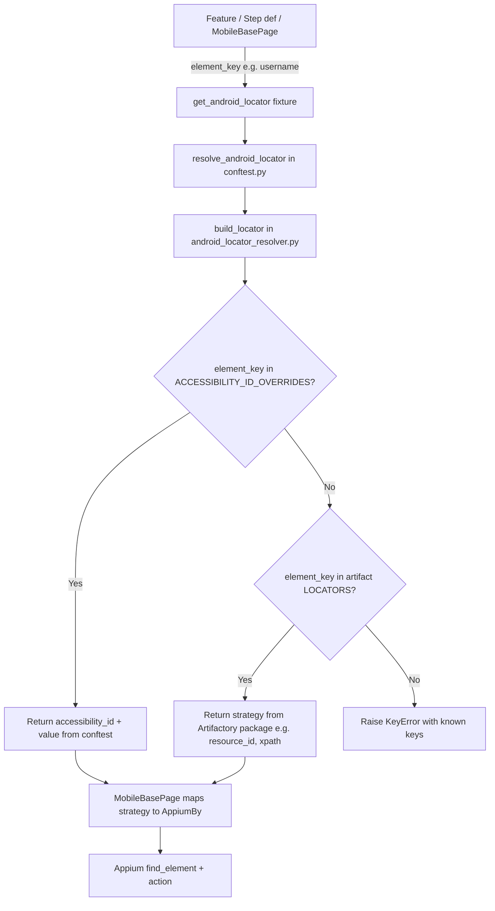

# BDD Selenium Framework

A lightweight **Behavior-Driven Development (BDD)** test framework built with **Python**, **pytest**, **pytest-bdd**, and **Selenium WebDriver**. It uses the **Page Object Model (POM)** pattern with two locator strategies:

| Platform | Pattern |
|----------|---------|
| **Web** | Label-based navigation — feature passes on-screen text → `LABEL_MAP` in constants |
| **Mobile (Android)** | Artifactory locator package + **accessibility id override** in `conftest.py` |

The demo web application is [SauceDemo](https://www.saucedemo.com/). The mobile example simulates locators published to **Artifactory** as a pip package.

---

## Tech Stack

| Tool | Purpose |
|------|---------|
| [pytest](https://docs.pytest.org/) | Test runner |
| [pytest-bdd](https://pytest-bdd.readthedocs.io/) | Gherkin `.feature` files → Python tests |
| [Selenium](https://www.selenium.dev/) | Web browser automation |
| [webdriver-manager](https://github.com/SergeyPirogov/webdriver_manager) | Auto-downloads ChromeDriver |
| [Appium](https://appium.io/) *(optional)* | Mobile Android automation |

---

## Project Structure

```
bdd_framework/
├── config/
│   └── settings.py              # Runtime config (URL, browser, waits)
├── artifacts/
│   └── mobile_locators_android/ # Simulated Artifactory locator package (no accessibility id)
├── constants/
│   ├── navigation_const.py      # Web locators + LABEL_MAP registry
│   └── mobile_const.py          # Mobile element keys
├── features/
│   ├── navigation.feature       # Web Gherkin scenarios
│   └── mobile_login.feature     # Mobile Android example
├── pages/
│   ├── base_page.py             # Web POM
│   └── mobile_base_page.py      # Mobile POM (uses conftest locator resolver)
├── step_defs/
│   ├── steps.py                 # Web BDD steps
│   └── mobile_steps.py          # Mobile BDD steps
├── tests/
│   ├── test_navigation.py
│   ├── test_mobile_login.py     # Skips without Appium
│   └── test_mobile_locator_resolver.py  # Unit tests (no device)
├── utils/
│   ├── webdriver_factory.py
│   ├── mobile_driver_factory.py
│   └── android_locator_resolver.py
├── reports/
│   └── screenshots/             # Auto-captured on test failure
├── conftest.py                  # pytest fixtures & hooks
├── pytest.ini                   # pytest configuration
├── requirements.txt             # Python dependencies
└── README.md
```

---

## Architecture

### Web flow (label-based navigation)

```
┌─────────────────────────────────────────────────────────┐
│  features/navigation.feature   (Gherkin — business language) │
└──────────────────────────┬──────────────────────────────┘
                           │
┌──────────────────────────▼──────────────────────────────┐
│  step_defs/steps.py            (Step definitions — glue code) │
└──────────────────────────┬──────────────────────────────┘
                           │
┌──────────────────────────▼──────────────────────────────┐
│  pages/base_page.py            (Page Object — browser actions) │
└──────────────────────────┬──────────────────────────────┘
                           │
┌──────────────────────────▼──────────────────────────────┐
│  constants/navigation_const.py (Locators + LABEL_MAP registry) │
└─────────────────────────────────────────────────────────┘
```

#### Web execution flow

```
Feature:  When user clicks on "Logout"
    │
    ▼
Step def: click_by_label(page, "Logout")
    │
    ▼
BasePage.click_by_label("Logout")
    │
    ▼
get_label_locator("Logout")  →  LABEL_MAP["logout"]  →  LOGOUT locator
    │
    ▼
Selenium: wait + click element
```

---

### Mobile flow (Artifactory locators + accessibility id override)

```
┌──────────────────────────────────────────────────────────────┐
│  features/mobile_login.feature        (Gherkin scenarios)       │
└──────────────────────────┬───────────────────────────────────┘
                           │
┌──────────────────────────▼───────────────────────────────────┐
│  step_defs/mobile_steps.py            (Mobile step definitions) │
└──────────────────────────┬───────────────────────────────────┘
                           │
┌──────────────────────────▼───────────────────────────────────┐
│  pages/mobile_base_page.py            (Mobile POM)              │
│  uses get_android_locator fixture                             │
└──────────────────────────┬───────────────────────────────────┘
                           │
┌──────────────────────────▼───────────────────────────────────┐
│  conftest.py                                                │
│  • ACCESSIBILITY_ID_OVERRIDES                               │
│  • resolve_android_locator()                                │
│  • get_android_locator fixture                              │
└──────────────────────────┬───────────────────────────────────┘
                           │
┌──────────────────────────▼───────────────────────────────────┐
│  utils/android_locator_resolver.py   build_locator()           │
└──────────────┬─────────────────────────────┬─────────────────┘
               │                             │
    ┌──────────▼──────────┐       ┌──────────▼──────────────────┐
    │ conftest overrides  │       │ Artifactory artifact package  │
    │ accessibility_id    │       │ artifacts/mobile_locators_  │
    │ (QA-owned)          │       │ android/login_screen.py       │
    │                     │       │ resource_id / xpath /         │
    │                     │       │ uiautomator only              │
    └─────────────────────┘       └───────────────────────────────┘
```

#### Mobile locator resolution flow



#### End-to-end example: `mobile_page.login("standard_user", "secret_sauce")`

```
mobile_page.type_into("username", "standard_user")
    │
    ▼
get_locator("username")                    ← fixture from conftest
    │
    ▼
resolve_android_locator("username")
    │
    ▼
build_locator("username", ARTIFACT_LOCATORS, ACCESSIBILITY_ID_OVERRIDES)
    │
    ├─ "username" IS in ACCESSIBILITY_ID_OVERRIDES
    │       → ("accessibility_id", "Username")
    │
    └─ if NOT in overrides (e.g. hypothetical new key)
            → ("resource_id", "com.saucedemo.mobile:id/username")  from artifact

    ▼
MobileBasePage._find_by_strategy("accessibility_id", "Username")
    │
    ▼
driver.find_element(AppiumBy.ACCESSIBILITY_ID, "Username")
```

#### Who owns what?

| File | Owns | Does NOT own |
|------|------|--------------|
| `artifacts/mobile_locators_android/login_screen.py` | Base locators from dev/Artifactory (`resource_id`, `xpath`, `uiautomator`) | `accessibility_id` |
| `conftest.py` | `ACCESSIBILITY_ID_OVERRIDES`, `resolve_android_locator()`, `get_android_locator` fixture | Appium driver logic |
| `utils/android_locator_resolver.py` | Merge logic (override wins, else artifact) | Override values |
| `constants/mobile_const.py` | Element key names (`username`, `login_button`, …) | Locator tuples |
| `pages/mobile_base_page.py` | Selenium/Appium actions, strategy → `AppiumBy` mapping | Locator source |
| `step_defs/mobile_steps.py` | Gherkin → page method calls | Locator resolution |

#### Locator resolution priority

| Priority | Source | Example result for `"username"` |
|----------|--------|----------------------------------|
| **1 (wins)** | `ACCESSIBILITY_ID_OVERRIDES` in `conftest.py` | `("accessibility_id", "Username")` |
| **2 (fallback)** | `LOCATORS` in Artifactory artifact | `("resource_id", "com.saucedemo.mobile:id/username")` |
| **3 (error)** | Key missing in both | `KeyError` |

#### Strategy → Appium mapping (`mobile_base_page.py`)

| Resolver returns | AppiumBy used |
|------------------|---------------|
| `accessibility_id` | `AppiumBy.ACCESSIBILITY_ID` |
| `resource_id` | `AppiumBy.ID` |
| `xpath` | `AppiumBy.XPATH` |
| `uiautomator` | `AppiumBy.ANDROID_UIAUTOMATOR` |

#### Web vs mobile locator pattern

| | Web | Mobile Android |
|---|-----|----------------|
| **Feature input** | On-screen label (`"Logout"`) | Element key via page/step (`username`) |
| **Registry location** | `constants/navigation_const.py` → `LABEL_MAP` | Artifactory artifact + `conftest.py` overrides |
| **Resolver** | `get_label_locator()` | `resolve_android_locator()` |
| **Override support** | Add row to `LABEL_MAP` | Add row to `ACCESSIBILITY_ID_OVERRIDES` |
| **Fallback** | None (explicit map only) | Artifact locator when no override |

---

## Label-Based Navigation

This framework supports readable navigation steps **without Scenario Outline**. Each step passes a different label at runtime:

```gherkin
When user clicks on "Open Menu"
And user clicks on "Logout"
And user clicks on "All Items"
```

### How it works

1. The feature file passes the label in quotes.
2. The step definition captures it via `parsers.parse('user clicks on "{label}"')`.
3. `get_label_locator()` normalizes the label (lowercase, trimmed) and looks it up in `LABEL_MAP`.
4. If the label is not registered, a `KeyError` is raised with a list of known labels.
5. `BasePage.click_by_label()` clicks the resolved element.

### Registry (`LABEL_MAP`)

Defined in `constants/navigation_const.py`:

| Feature label | Maps to |
|---------------|---------|
| `"Login"` | `LOGIN_BTN` |
| `"Open Menu"` / `"Menu"` | `MENU_BTN` |
| `"All Items"` | `ALL_ITEMS` |
| `"Logout"` | `LOGOUT` |

> **Important:** Every label used in a `user clicks on "..."` step must exist in `LABEL_MAP`. There is no dynamic XPath fallback — all navigation labels are explicit.

---

## Constants vs Config vs Input

| Type | Location | Example | When to use |
|------|----------|---------|-------------|
| **Constants** | `constants/navigation_const.py` | Locators, `LABEL_MAP` | Fixed values tied to the UI |
| **Config** | `config/settings.py` + env vars | `BASE_URL`, `HEADLESS` | Values that change per environment |
| **BDD input** | `features/*.feature` | `"standard_user"`, `"Logout"` | Scenario data written by QA/BA |

Python does not use a `.constant` file extension. Constants are regular `.py` modules.

---

## Prerequisites

- Python 3.10+
- Google Chrome installed
- pip

---

## Setup

### 1. Clone / open the project

```bash
cd bdd_framework
```

### 2. Create a virtual environment (recommended)

```bash
python -m venv venv

# Windows
venv\Scripts\activate

# macOS / Linux
source venv/bin/activate
```

### 3. Install dependencies

```bash
pip install -r requirements.txt
```

---

## Running Tests

### Run all tests

```bash
pytest
```

### Run navigation feature only

```bash
pytest tests/test_navigation.py
```

### Run with marker

```bash
pytest -m navigation
```

### Run headless

```bash
# Windows PowerShell
$env:HEADLESS="true"
pytest

# Windows CMD
set HEADLESS=true && pytest

# macOS / Linux
HEADLESS=true pytest
```

### Run against a different URL

```bash
# Windows PowerShell
$env:BASE_URL="https://www.saucedemo.com/"
pytest
```

---

## Environment Variables

| Variable | Default | Description |
|----------|---------|-------------|
| `BASE_URL` | `https://www.saucedemo.com/` | Application URL |
| `BROWSER` | `chrome` | Browser name (only Chrome is configured) |
| `HEADLESS` | `false` | Run Chrome without a visible window |
| `WAIT` | `10` | Implicit wait in seconds |

---

## Feature File

`features/navigation.feature` contains two scenarios:

1. **Logout via menu labels** — opens menu, clicks Logout, verifies title.
2. **Navigate using different labels** — opens menu, clicks All Items, verifies inventory page.

```gherkin
Background:
  Given the application is open
  When I login with username "standard_user" and password "secret_sauce"

Scenario: Logout via menu labels
  When user clicks on "Open Menu"
  And user clicks on "Logout"
  Then the page title should contain "Swag Labs"
```

---

## Step Definitions

All steps live in `step_defs/steps.py`:

| Step | Type | Description |
|------|------|-------------|
| `Given the application is open` | Given | Opens `BASE_URL` |
| `When I login with username "..." and password "..."` | When | Fills login form and submits |
| `When user clicks on "..."` | When | Clicks element by label from `LABEL_MAP` |
| `Then the page title should contain "..."` | Then | Asserts browser title |
| `Then I should see the inventory page` | Then | Asserts inventory list is visible |

Steps are registered via `pytest_plugins` in `conftest.py`.

---

## Page Object (`BasePage`)

`pages/base_page.py` provides reusable browser actions:

| Method | Description |
|--------|-------------|
| `open(url)` | Navigate to URL |
| `click(locator)` | Wait for clickable element and click |
| `type_into(locator, text)` | Clear field and type text |
| `is_visible(locator)` | Check if element is visible |
| `click_by_label(label)` | Resolve label → locator → click |

---

## Fixtures (`conftest.py`)

| Fixture | Scope | Description |
|---------|-------|-------------|
| `driver` | function | Creates and quits Chrome per web test |
| `mobile_driver` | function | Creates Appium session (skips if `APPIUM_SERVER_URL` unset) |
| `base_url` | session | Returns `BASE_URL` from settings |
| `page` | function | Returns `BasePage(driver)` for web tests |
| `get_android_locator` | function | Returns `resolve_android_locator` for mobile POM |
| `mobile_page` | function | Returns `MobileBasePage(mobile_driver, get_android_locator)` |

### Screenshot on failure

If a test fails, a screenshot is saved automatically to:

```
reports/screenshots/<test_name>_<timestamp>.png
```

---

## How to Add a New Clickable Label

### 1. Add the locator in `constants/navigation_const.py`

```python
ABOUT_LINK = (By.ID, "about_sidebar_link")
```

### 2. Register it in `LABEL_MAP`

```python
LABEL_MAP = {
    ...
    "about": ABOUT_LINK,
}
```

### 3. Use it in a feature file

```gherkin
When user clicks on "About"
```

No changes needed in step definitions — the existing `user clicks on "{label}"` step handles it.

---

## How to Add a New Feature

### 1. Create a feature file

```
features/my_feature.feature
```

### 2. Add new steps to `step_defs/steps.py` (if needed)

```python
@then("I should see the about page")
def check_about(page):
    assert page.is_visible(ABOUT_LINK)
```

### 3. Create a test file to bind the feature

```python
# tests/test_my_feature.py
from pytest_bdd import scenarios

scenarios("../features/my_feature.feature")
```

### 4. Run

```bash
pytest tests/test_my_feature.py
```

---

## How to Add a New Page Locator (non-label)

For form fields or elements not used via `user clicks on "..."`:

1. Add the locator constant in `constants/navigation_const.py`.
2. Use it directly in step definitions or page methods.

```python
# step_defs/steps.py
page.type_into(NEW_FIELD, "some value")
```

---

## pytest Configuration

`pytest.ini` settings:

| Setting | Value |
|---------|-------|
| `testpaths` | `tests` |
| `bdd_features_base_dir` | `features` |
| `addopts` | `-v --tb=short` |
| Markers | `navigation`, `mobile`, `example` |

---

## Dependencies

```
pytest>=8.0.0
pytest-bdd>=7.0.0
selenium>=4.15.0
webdriver-manager>=4.0.0
```

---

## Troubleshooting

### `KeyError: '...' is not in LABEL_MAP`

The label in your feature file is not registered. Add it to `LABEL_MAP` in `constants/navigation_const.py`.

### `Only chrome is set up right now`

The framework currently supports Chrome only. Install Chrome or set `BROWSER=chrome`.

### ChromeDriver issues

`webdriver-manager` downloads the driver automatically. Ensure you have network access on first run.

### Element not found / timeout

- Increase wait: `WAIT=15 pytest`
- Verify the locator in `navigation_const.py` matches the live DOM
- Run without headless to visually debug: `HEADLESS=false pytest`

### Step definition not found

Ensure `step_defs/steps.py` is listed in `pytest_plugins` inside `conftest.py`.

---

## Mobile Android — Locator Flow (Detailed)

This is the core mobile pattern: **locators come from an Artifactory-published package**, but **QA overrides with accessibility id in `conftest.py`** because the artifact does not ship accessibility ids.

### Why this pattern exists

| Party | Delivers | Limitation |
|-------|----------|------------|
| Dev / mobile team | Pip package to Artifactory with `resource_id`, `xpath`, `uiautomator` | No `accessibility_id` in the artifact |
| QA / automation | Stable `accessibility_id` values observed on real devices | Should not fork the artifact — override in test repo |
| `conftest.py` | Single place to wire overrides for the whole suite | Keeps artifact package read-only |

### Step-by-step locator flow

**Step 1 — Artifactory package (installed via pip in real projects)**

`artifacts/mobile_locators_android/login_screen.py` simulates what you get from:

```bash
pip install mobile-locators-android==1.0.0 \
  --index-url https://artifactory.company.com/api/pypi/pypi/simple
```

```python
LOCATORS = {
    "username": ("resource_id", "com.saucedemo.mobile:id/username"),
    "password": ("resource_id", "com.saucedemo.mobile:id/password"),
    "login_button": ("xpath", '//android.widget.Button[@text="LOGIN"]'),
    "inventory_list": ("uiautomator", 'new UiSelector().resourceId("com.saucedemo.mobile:id/inventory_list")'),
    "menu_button": ("resource_id", "com.saucedemo.mobile:id/menu"),
    "logout_button": ("xpath", '//android.widget.TextView[@text="Logout"]'),
}
```

**Step 2 — QA override map in `conftest.py`**

```python
ACCESSIBILITY_ID_OVERRIDES = {
    "username": "Username",
    "password": "Password",
    "login_button": "Login",
    "inventory_list": "Inventory list",
    "menu_button": "Open navigation menu",
    "logout_button": "Logout",
}
```

**Step 3 — Resolver method in `conftest.py`**

```python
def resolve_android_locator(element_key: str) -> tuple[str, str]:
    return build_locator(element_key, ARTIFACT_LOCATORS, ACCESSIBILITY_ID_OVERRIDES)

@pytest.fixture
def get_android_locator():
    return resolve_android_locator
```

**Step 4 — Merge logic in `utils/android_locator_resolver.py`**

```python
def build_locator(element_key, artifact_locators, accessibility_overrides):
    if element_key in accessibility_overrides:
        return ("accessibility_id", accessibility_overrides[element_key])
    if element_key not in artifact_locators:
        raise KeyError(...)
    return artifact_locators[element_key]
```

**Step 5 — Mobile POM consumes resolver via fixture**

```python
class MobileBasePage:
    def __init__(self, driver, get_locator):
        self.get_locator = get_locator   # ← resolve_android_locator from conftest

    def click(self, element_key):
        strategy, value = self.get_locator(element_key)
        # maps to AppiumBy.ACCESSIBILITY_ID / ID / XPATH / ANDROID_UIAUTOMATOR
        self.driver.find_element(by_map[strategy], value).click()
```

**Step 6 — BDD step calls page (no locator logic in steps)**

```gherkin
When mobile user logs in with username "standard_user" and password "secret_sauce"
```

```python
@when('mobile user logs in with username "{username}" and password "{password}"')
def mobile_login(mobile_page, username, password):
    mobile_page.login(username, password)   # uses element keys, not raw locators
```

### Resolved locator examples

| `element_key` | Override in conftest? | Final locator used at runtime |
|---------------|----------------------|-------------------------------|
| `username` | Yes → `"Username"` | `("accessibility_id", "Username")` |
| `login_button` | Yes → `"Login"` | `("accessibility_id", "Login")` |
| `inventory_list` | Yes → `"Inventory list"` | `("accessibility_id", "Inventory list")` |
| *(any key not in overrides)* | No | Whatever the artifact ships, e.g. `("xpath", '...')` |

### Feature file (`features/mobile_login.feature`)

```gherkin
@mobile @example
Feature: Mobile Android login

  Scenario: Login using overridden accessibility ids
    When mobile user logs in with username "standard_user" and password "secret_sauce"
    Then mobile inventory should be visible

  Scenario: Logout via mobile menu labels
    When mobile user logs in with username "standard_user" and password "secret_sauce"
    And mobile user taps "Open Menu"
    And mobile user taps "Logout"
    Then mobile login screen should be visible
```

### Run mobile tests

**Unit tests (no device — validates resolver logic only)**

```bash
pytest tests/test_mobile_locator_resolver.py -v
```

**BDD tests (requires Appium + Android app)**

```bash
pip install Appium-Python-Client

$env:APPIUM_SERVER_URL="http://127.0.0.1:4723"
$env:ANDROID_APP_PACKAGE="com.saucedemo.mobile"
$env:ANDROID_APP_ACTIVITY=".MainActivity"
pytest tests/test_mobile_login.py -m mobile
```

### Mobile environment variables

| Variable | Default | Description |
|----------|---------|-------------|
| `APPIUM_SERVER_URL` | — | Required for mobile BDD tests (e.g. `http://127.0.0.1:4723`) |
| `ANDROID_DEVICE` | `emulator-5554` | Device name |
| `ANDROID_APP_PACKAGE` | `com.saucedemo.mobile` | App package |
| `ANDROID_APP_ACTIVITY` | `.MainActivity` | Launch activity |

### How to add a new mobile element

**Case A — artifact already has the key, app has accessibility id**

1. Confirm key exists in artifact `LOCATORS` (or wait for new artifact version).
2. Add to `ACCESSIBILITY_ID_OVERRIDES` in `conftest.py`:

```python
ACCESSIBILITY_ID_OVERRIDES = {
    ...
    "settings_button": "Settings",
}
```

3. Use the key in `MobileBasePage` or step defs — no other changes needed.

**Case B — new element in new artifact version**

1. Upgrade pip package from Artifactory.
2. Add element key to `constants/mobile_const.py` (optional, for readability).
3. Add accessibility override in `conftest.py` if the app exposes one.
4. If no accessibility id exists, resolver automatically uses artifact locator.

**Case C — tap by feature label (menu-style)**

Map feature label → element key in `step_defs/mobile_steps.py`:

```python
label_map = {
    "open menu": MENU_BUTTON,
    "logout": LOGOUT_BUTTON,
}
mobile_page.click(label_map[key])   # key still goes through conftest resolver
```

### Mobile troubleshooting

| Error | Fix |
|-------|-----|
| `KeyError: Unknown mobile element` | Key missing from artifact — upgrade package or use correct key |
| Tests skipped | Set `APPIUM_SERVER_URL` |
| Wrong element clicked | Check `ACCESSIBILITY_ID_OVERRIDES` value matches device accessibility label |
| Override not applied | Ensure element key matches exactly (e.g. `"username"` not `"Username"`) |
| `ImportError: Appium` | `pip install Appium-Python-Client` |

---

## Design Decisions

- **Registry-only web label lookup** — no dynamic XPath; every web label must be explicitly mapped in `LABEL_MAP`.
- **Mobile override in conftest** — accessibility ids live in test repo, not in Artifactory artifact; artifact remains the fallback.
- **Single step files per platform** — `steps.py` for web, `mobile_steps.py` for mobile.
- **Flat constants** — locators as module-level variables instead of nested classes.
- **Chrome only (web)** — extend `webdriver_factory.py` for other browsers when needed.

---

## License

Internal / educational use. Update as needed for your organization.
